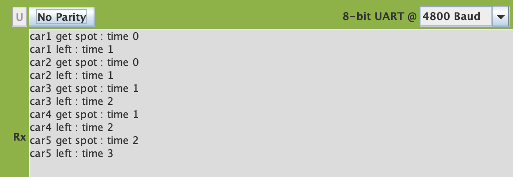

# Operating System 2019 Spring Checkpoint 05

## Preemptive Multithreading
For this programming project checkpoint, you are to (1) add a delay(n) function to your preemptive multithreading and semaphore code, (2) ensure your threads can terminate so its space can be recycled by another thread. (3) test your delay and thread recycling based on (but not identical) to the parking lot example you did earlier in the semester in Python.
There will be less hints for this CheckPoint.

## Todo
1. **Turn in the source files for preemptive multithreading to be compiled using SDCC and targets EdSim51.**
2. **preemptive.c:** contains the new code for delay(n) function, where n is the number of time units to delay. 
3. **preemptive.c:** in case you have not done so already, ThreadCreate(), ThreadExit() need to allow a thread to be recycled after the function returns normally or after it calls ThreadExit() function.
4. **testparking.c:** which contains the parking lot example to test your updated threads package.
5. **preemptive.h:** which is also a required file to compile the project 

## Scoring (Check detailed requirments via iLMS)

| **Item**                                         | **Score** |
| :----------------------------------------------: | :-------: |
| Robust Thread Termination and Creation         | 50%       |
| Parking Lot Example                             | 50%      |
| Typescript for compilation                        | 2%     |
| Screenshots and explanation                      | 18%     |

## Report below here
### Screenchot
</img>
### Data Memory
</img>
